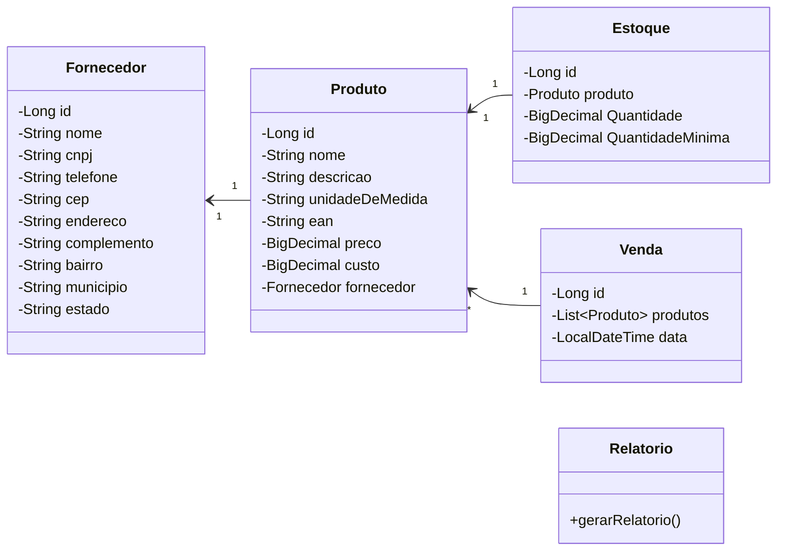

```mermaid
classDiagram
    direction RL
    
    Produto "1" --> "1" Fornecedor
    Estoque "1" --> "1" Produto
    Venda "1" --> "*" Produto

    class Produto{
        -Long id
        -String nome
        -String descricao
        -String unidadeDeMedida
        -String ean
        -BigDecimal preco
        -BigDecimal custo
        -Fornecedor fornecedor
    }

    class Fornecedor{
        -Long id
        -String nome
        -String cnpj
        -String telefone
        -String cep
        -String endereco
        -String complemento
        -String bairro
        -String municipio
        -String estado
    }

    class Estoque{
        -Long id
        -Produto produto
        -BigDecimal Quantidade
        -BigDecimal QuantidadeMinima
    }

    class Relatorio{
        +gerarRelatorio()
    }

    class Venda{
        -Long id
        -List~Produto~ produtos
        -LocalDateTime data
    }
```