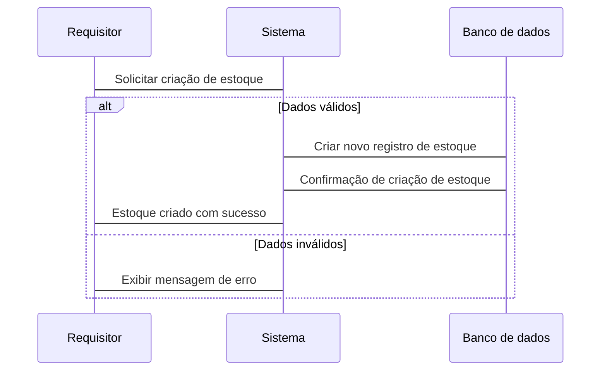

```mermaid
sequenceDiagram
    participant Requisitor
    participant Sistema
    participant Banco_de_Dados as Banco de dados

    Requisitor -> Sistema: Solicitar criação de estoque
    
    alt Dados válidos
        Sistema -> Banco_de_Dados: Criar novo registro de estoque
        Banco_de_Dados -> Sistema: Confirmação de criação de estoque
        Sistema -> Requisitor: Estoque criado com sucesso
    else Dados inválidos
        Sistema -> Requisitor: Exibir mensagem de erro
    end
```