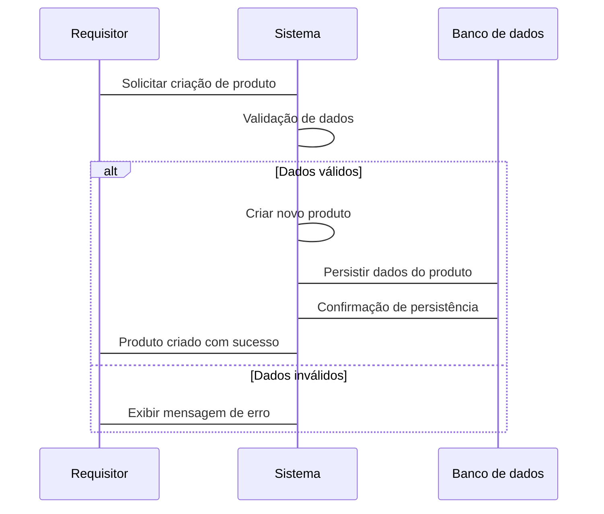

```mermaid
sequenceDiagram
    participant Requisitor
    participant Sistema
    participant Banco_de_Dados as Banco de dados

    Requisitor -> Sistema: Solicitar criação de produto
    Sistema -> Sistema: Validação de dados
    alt Dados válidos
        Sistema -> Sistema: Criar novo produto
        Sistema -> Banco_de_Dados: Persistir dados do produto
        Banco_de_Dados -> Sistema: Confirmação de persistência
        Sistema -> Requisitor: Produto criado com sucesso
    else Dados inválidos
        Sistema -> Requisitor: Exibir mensagem de erro
    end
```