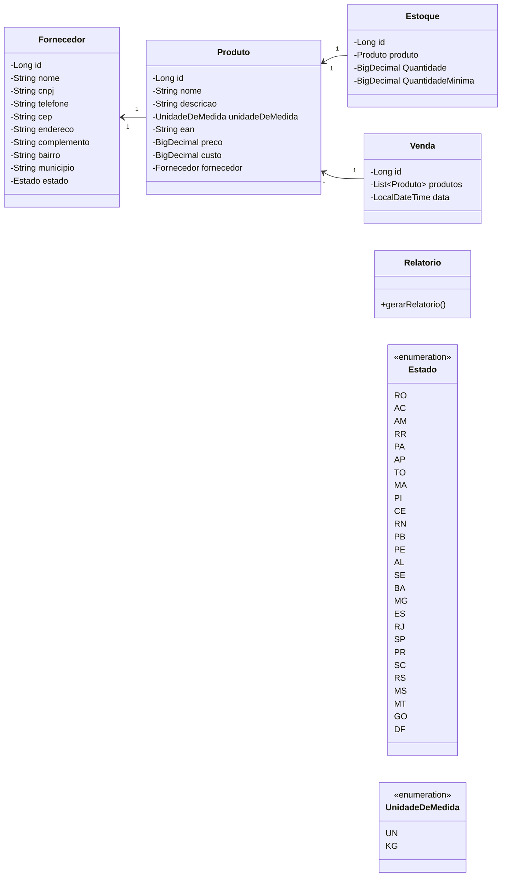

```mermaid
classDiagram
    direction RL
    
    Produto "1" --> "1" Fornecedor
    Estoque "1" --> "1" Produto
    Venda "1" --> "*" Produto

    class Produto{
        -Long id
        -String nome
        -String descricao
        -UnidadeDeMedida unidadeDeMedida
        -String ean
        -BigDecimal preco
        -BigDecimal custo
        -Fornecedor fornecedor
    }

    class Fornecedor{
        -Long id
        -String nome
        -String cnpj
        -String telefone
        -String cep
        -String endereco
        -String complemento
        -String bairro
        -String municipio
        -Estado estado
    }

    class Estoque{
        -Long id
        -Produto produto
        -BigDecimal Quantidade
        -BigDecimal QuantidadeMinima
    }

    class Relatorio{
        +gerarRelatorio()
    }

    class Venda{
        -Long id
        -List~Produto~ produtos
        -LocalDateTime data
    }

    class Estado{
        <<enumeration>>
        RO
        AC
        AM
        RR
        PA
        AP
        TO
        MA
        PI
        CE
        RN
        PB
        PE
        AL
        SE
        BA
        MG
        ES
        RJ
        SP
        PR
        SC
        RS
        MS
        MT
        GO
        DF
    }

    class UnidadeDeMedida{
        <<enumeration>>
        UN
        KG
    }
```