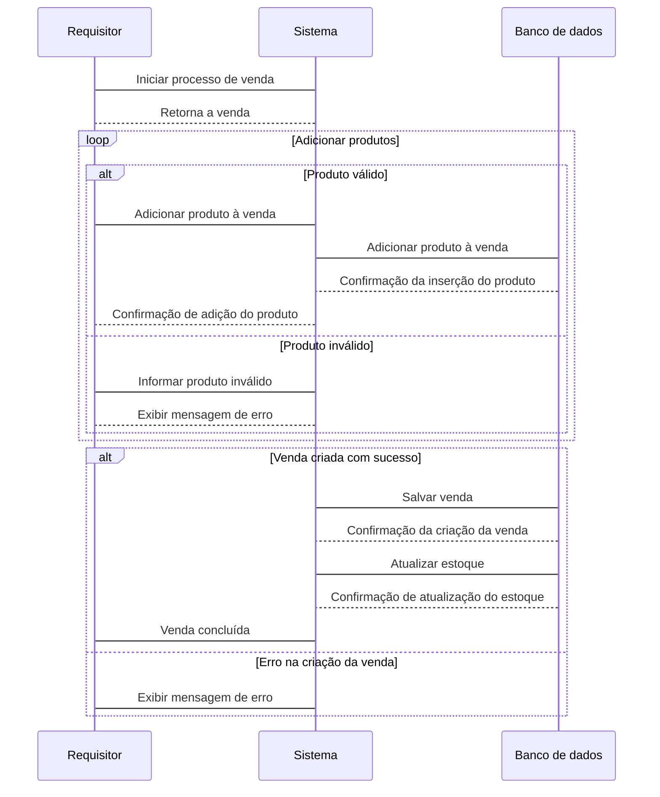

```mermaid
sequenceDiagram
    participant Requisitor
    participant Sistema
    participant Banco_de_Dados as Banco de dados

    Requisitor -> Sistema: Iniciar processo de venda
    Sistema --> Requisitor: Retorna a venda
    loop Adicionar produtos
        alt Produto válido
            Requisitor -> Sistema: Adicionar produto à venda
            Sistema -> Banco_de_Dados: Adicionar produto à venda
            Banco_de_Dados --> Sistema: Confirmação da inserção do produto
            Sistema --> Requisitor: Confirmação de adição do produto
        else Produto inválido
            Requisitor -> Sistema: Informar produto inválido
            Sistema --> Requisitor: Exibir mensagem de erro
        end
    end

    alt Venda criada com sucesso
        Sistema -> Banco_de_Dados: Salvar venda
        Banco_de_Dados --> Sistema: Confirmação da criação da venda
        Sistema -> Banco_de_Dados: Atualizar estoque
        Banco_de_Dados --> Sistema: Confirmação de atualização do estoque
        Sistema -> Requisitor: Venda concluída
    else Erro na criação da venda
        Sistema -> Requisitor: Exibir mensagem de erro
    end

```